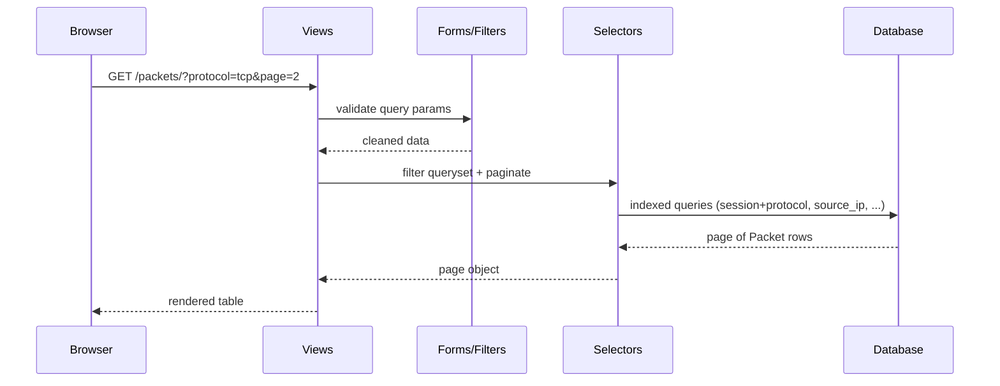
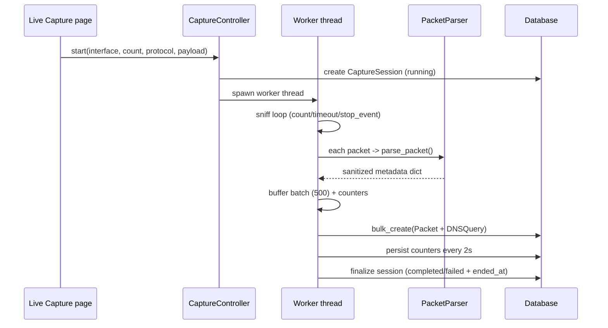

# Architecture

This document describes the architecture of the CodeAlpha Advanced Network
Traffic Analyzer, the modules involved, and the data flow between them.

## Overview

The platform is split into two independent domains that share only the
database:

1. **Django web application** — presentation, analytics, reporting, controls.
2. **Capture worker** — Scapy-based packet capture and parsing.

This separation is deliberate: packet capture is long-running and blocking, so
running it inside a request handler would freeze the web server. The worker
runs as a background thread (web-started captures) or a separate process
(CLI / `capture_worker.py`).

## High-Level Diagram

```mermaid
flowchart LR
    subgraph Browser
        UI[Dashboard / Explorer / Analytics]
    end
    subgraph Django["Django Web App"]
        Views[Views]
        Services[Service layer]
        Selectors[Selectors / filters]
        ORM[Django ORM]
    end
    subgraph DB[(Database)]
        Session[(CaptureSession)]
        Packet[(Packet)]
        DNS[(DNSQuery)]
    end
    subgraph Worker["Capture Worker"]
        Scapy[Scapy sniff]
        Parser[Packet parser]
        Stats[Statistics]
    end

    UI --> Views
    Views --> Services
    Services --> ORM
    ORM --> DB
    Packet --> ORM

    Net[Network interface] --> Scapy
    Scapy --> Parser
    Parser --> Stats
    Stats --> DB
```

## Module Map

```
config/            Django settings, URL root, WSGI/ASGI entrypoints
core/              SecurityHeadersMiddleware, rate limiting, validators
sniffer/           Models, views, forms, filters, selectors, services,
                   serializers, admin, templates, static assets,
                   management commands (capture, list_interfaces, ...)
capture/           packet_parser.py    defensive per-packet parsing
                   protocol_analyzer.py aggregation queries
                   statistics.py       session stats + anomaly heuristics
                   interface_manager.py dynamic interface discovery
                   capture_service.py  worker thread, batching, lifecycle
reports/           services.py         shared report context
                   csv_export.py       CSV rendering
                   json_export.py      JSON rendering
                   html_report.py      standalone HTML rendering
tests/             factories + 7 test modules (102 tests)
```

## Data Flow — Web Request



## Data Flow — Capture



## Key Design Decisions

| Decision | Rationale |
|----------|-----------|
| Worker outside request cycle | Capture can never block the web server |
| Batch `bulk_create` (500) | Avoids per-packet writes; keeps capture fast |
| In-memory counters + timer persist | Live UI status without DB write per packet |
| `threading.Event` stop-filter | Graceful, packet-accurate stopping |
| Parser never raises on packets | One malformed packet cannot kill a capture |
| DB writes wrapped in retry | SQLite `database is locked` resilience |
| `json_script` chart payloads | No string interpolation of data into JS |
| Local vendored Chart.js | Works offline; no CDN dependency |
| Field-aware filters | CharField vs IntegerField exclusions differ |
| SQLite by default, PostgreSQL-ready | `DATABASE_URL` switch without model changes |

## Concurrency Notes

- The web app and worker use separate DB connections; SQLite serializes writes
  with a busy timeout and the worker retries transient lock errors.
- Web-started captures register a handle in the Django process. The single
  `runserver` process can start, poll and stop them. For multi-process
  production deployments, run captures via `python manage.py capture` or
  `python capture_worker.py`, whose lifecycle is fully database-driven.
- The statistics thread and worker thread are daemon threads and terminate
  with the capture lifecycle event.
